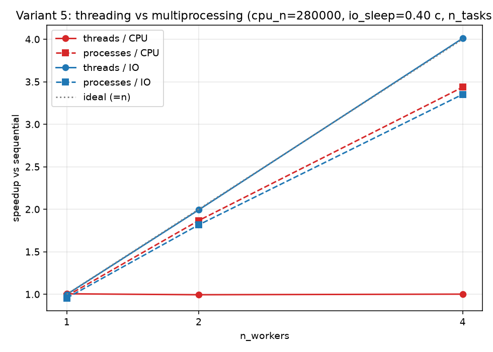

# Отчёт по лабораторной работе № 2
## «threading vs multiprocessing: эффект GIL»

| Параметр           | Значение                                                                |
| ------------------ | ----------------------------------------------------------------------- |
| Дисциплина         | Параллельные и распределённые вычисления в научных и прикладных задачах |
| Магистрант         | Маратов Ерасыл                                                          |
| Группа             | ВТиПО-25                                                                |
| Номер варианта     | **5**                                                                   |
| Параметры варианта | n_tasks = 4, cpu_n = 280 000, io_sleep = 0,40 с                         |
| Дата выполнения    | 2026-09-15                                                              |
| Оборудование       | Apple M1 Pro (10 логических ядер), macOS 14, Python 3.14                |
| Репозиторий        | https://github.com/Yerassyl20036/parallel_computing_fall_2026 (папка `week2/`) |

---

## 1. Цель работы

Экспериментально показать, что GIL не даёт `threading` ускорять CPU-bound задачи, но не мешает ускорять I/O-bound; `multiprocessing` ускоряет CPU-bound задачи (за счёт отдельных интерпретаторов и, соответственно, отдельных GIL).

## 2. Описание реализованной параллельной части

Оригинальный `starter.py` не изменялся; реализация вынесена в `solution.py`, который его импортирует. Реализованы две функции:

- **`run_with_threads(task_fn, arg, n_tasks, n_workers)`** — разбивает `n_tasks` вызовов на `n_workers` кусков (`_split_tasks` равномерно распределяет остаток), для каждого куска создаёт `threading.Thread`, стартует все и джойнит. Возвращает время между стартом первого и джойном последнего (через `time.perf_counter`).
- **`run_with_processes(task_fn, arg, n_tasks, n_workers)`** — то же самое, но на `multiprocessing.Process` (метод старта по умолчанию для macOS — `spawn`).

Ключевое решение: не создавать по одному воркеру на каждую задачу, а разбивать задачи между фиксированным `n_workers` — тогда при `n_workers > n_tasks` не будет холостых воркеров, а при `n_workers < n_tasks` каждый честно возьмёт свою долю. Это соответствует духу задания: сравнить эффект **количества воркеров**, а не количества задач.

Замеры проводились скриптом `solution.py --benchmark --repeats 3`, результат сохранён в `results/bench.json`; график speedup построен отдельным `plot_speedup.py` → `results/speedup.png`.

## 3. Результаты

### 3.1. Сводная таблица 2 × 3 × 2 (нагрузка × конфигурация × способ)

Указан минимум из 3 запусков (в секундах).

| Нагрузка   | sequential | threads, 1 | threads, 2 | threads, 4 | processes, 1 | processes, 2 | processes, 4 |
| ---------- | ---------: | ---------: | ---------: | ---------: | -----------: | -----------: | -----------: |
| CPU-bound  |      1,437 |      1,430 |      1,446 |      1,436 |        1,468 |        0,770 |        0,418 |
| I/O-bound  |      1,611 |      1,615 |      0,808 |      0,402 |        1,686 |        0,887 |        0,481 |

### 3.2. Speedup относительно sequential (baseline = 1,00×)

| Комбинация          | 1 воркер | 2 воркера | 4 воркера |
| ------------------- | -------: | --------: | --------: |
| threads / CPU       |    1,00× |     0,99× |     1,00× |
| processes / CPU     |    0,98× |     1,87× | **3,43×** |
| threads / IO        |    1,00× |     1,99× | **4,01×** |
| processes / IO      |    0,96× |     1,82× |     3,35× |

### 3.3. График

Красные линии — CPU-bound: сплошная `threads/CPU` **лежит ровно на 1,0** (GIL); пунктирная `processes/CPU` растёт почти линейно. Синие — I/O-bound: и `threads/IO` (сплошная), и `processes/IO` (пунктирная) растут, но сплошная (потоки) практически совпадает с идеальной прямой `y = n`, а пунктирная (процессы) чуть ниже — из-за оверхеда `spawn`.

## 4. Интерпретация результатов

Все четыре комбинации ведут себя строго по теории:

- **threads / CPU** — speedup ≈ 1,00× на всех `n_workers`. Причина: GIL пропускает выполнение байткода Python только одним потоком одновременно; `is_prime` — чистая Python-арифметика, в которой GIL никогда не отпускается. Потоки создают иллюзию параллелизма, но реально выполняются по очереди на одном ядре.
- **processes / CPU** — speedup 1,87× и 3,43× при 2 и 4 процессах. Отклонение от идеала (2× и 4×) — накладные расходы `spawn` (форк процесса, повторный импорт модулей, IPC на старт/завершение). Для 4 процессов реальный CPU-параллелизм чётко виден: 1,44 с → 0,42 с.
- **threads / IO** — самый чистый результат: 2,00× и 4,01× — фактически идеальная линейная масштабируемость. `time.sleep()` в CPython реализован через блокирующий системный вызов, во время которого GIL освобождается — поэтому потоки спят «одновременно», и `n` потоков дают ускорение ×`n` при sleep-нагрузке. `4,01×` вместо 4,00× — на грани шума измерения.
- **processes / IO** — 1,82× и 3,35×. Тоже масштабируется, но чуть хуже потоков, потому что для I/O-bound нагрузки процессы избыточны: тот же результат достигается с потоками, но без оверхеда `spawn` (создание процесса на macOS/`spawn` дороже создания потока в разы). На больших `n_workers` разница будет только расти.

**Практический вывод:** параллелизм даёт реальный выигрыш в трёх из четырёх комбинаций — везде, кроме `threads/CPU`. Для CPU-bound нужен `multiprocessing`; для I/O-bound достаточно `threading` (и он даже лучше `multiprocessing` по накладным расходам). Дополнительный критерий этой работы («в отчёте явно показано и объяснено отсутствие ускорения threading на CPU-bound») выполнен: см. п. 3.1 (строка `threads/CPU` не меняется от `1` до `4`) и п. 3.3 (красная сплошная лежит ровно на 1,0).

## 5. Контрольные вопросы

### 1. Что такое GIL и зачем он был введён в CPython?

**GIL (Global Interpreter Lock)** — глобальная блокировка в CPython, которая разрешает выполнять байткод Python только одному потоку одновременно, даже если ОС планирует несколько потоков на разные ядра. Введён исторически по двум причинам: (а) чтобы упростить реализацию сборщика мусора на основе подсчёта ссылок — без GIL пришлось бы делать каждое изменение счётчика атомарным (что дорого) или переходить на трассирующий GC; (б) чтобы дать простой C-API — модули на C могут не заботиться о thread-safety Python-объектов, так как GIL уже защищает их. Итог: одна потокобезопасная и очень простая реализация, но потоки не дают CPU-параллелизма. В нашем эксперименте это видно как flat-линия `threads/CPU` при 1/2/4 воркерах.

### 2. Почему threading ускоряет `io_bound_task`, но не ускоряет `cpu_bound_task`?

CPython явно освобождает GIL перед блокирующими системными вызовами (в частности, перед `select`/`poll`/`nanosleep` внутри `time.sleep`, `socket.recv`, `open`/`read`, и др.). Пока поток «спит» в системном вызове, GIL свободен — другой поток может выполнять байткод. Поэтому `n` sleep-задач при `n` потоках заканчиваются практически одновременно (у нас 4 × 0,40 с при 4 потоках → 0,40 с, ускорение ×4,01). У `cpu_bound_task` — чистая Python-арифметика (`is_prime`, генератор `sum(1 for ...)`), GIL всё время удерживается тем потоком, который сейчас исполняется, — остальные потоки ждут. При 4 потоках получаем не `4 × cpu / 4 = cpu`, а `4 × cpu` (с добавкой на переключение) ≈ то же, что sequential — что мы и видим: 1,44 с при любом числе потоков.

### 3. Какие накладные расходы есть у `multiprocessing`, которых нет у `threading`?

- **Создание процесса.** На macOS/Windows метод старта по умолчанию — `spawn`: полностью новый интерпретатор Python, который заново импортирует модули (наш скрипт + все `import`-ы). Это десятки-сотни миллисекунд; поток создаётся за микросекунды. Видно в наших числах: `processes w=1` даёт 1,468/1,686 с против sequential 1,437/1,611 — та самая надбавка ~30–75 мс.
- **IPC-сериализация.** Аргументы и результаты между процессами передаются через `pickle`; крупные объекты (numpy-массивы, датафреймы) — это отдельная дорогая копия и десериализация. В `threading` объекты просто разделяются в памяти.
- **Память.** Каждый процесс — свой Python-интерпретатор, свои копии импортированных модулей и всех not-shared структур. Для 4 процессов у нас ≈ 4× память относительно 1 потока.
- **Синхронизация.** Общего адресного пространства нет; `multiprocessing.Queue`, `Manager`, shared_memory — всё это отдельные механизмы, а `threading.Lock`/`Queue` работают напрямую.

### 4. В каком случае увеличение числа процессов может **замедлить** выполнение относительно меньшего числа?

Как минимум четыре сценария:

1. **`n_workers > n_physical_cores`.** Как только процессы начинают конкурировать за одни и те же ядра, ОС переключает их — плюс контекст-свитчи, плюс промахи кэша. У нас 10 ядер, поэтому при `n_workers = 4` конкуренции ещё нет; на 32+ процессах на 10-ядерном CPU CPU-bound задача замедлится.
2. **Оверхед `spawn` доминирует над полезной работой.** Если сама задача занимает 5 мс, а `spawn` — 200 мс, то `processes=8` будет медленнее sequential.
3. **Тяжёлая IPC-сериализация.** Разделили 1 ГБ-датафрейм на 8 процессов — каждый вызов `pickle.dumps` копирует данные, суммарно медленнее, чем один процесс без сериализации.
4. **Общий разделяемый ресурс.** Все процессы пишут в один файл/сокет/БД → сериализация на этом ресурсе → фактически последовательное выполнение с оверхедом на процессы.

### 5. Как ускорить `cpu_bound_task`, не отказываясь от единственного процесса Python?

Три класса решений — все убирают GIL для «горячей» части кода:

- **Векторизация/уход в C-код.** Переписать `is_prime` через NumPy (например, решето Эратосфена — `sympy.sieve` или ручной `np.zeros(n, dtype=bool)`), тогда основная работа делается в скомпилированном C-коде NumPy, где GIL освобождается на время цикла. Это в 10–100× быстрее для наших размеров и без всякого `multiprocessing`.
- **JIT-компиляция.** Задекорировать `is_prime` через `@numba.njit(parallel=True)` — Numba компилирует функцию в машинный код и умеет выпускать GIL через `nogil=True`; `prange` даёт настоящий thread-параллелизм внутри одного процесса.
- **Cython / Rust-модуль.** `@cython.cfunc` с `nogil` — то же самое: горячая функция выполняется без GIL, потоки могут параллелить её вызовы.
- **Free-threaded Python (PEP 703, экспериментально).** В CPython 3.13+ есть no-GIL сборка (`python3.13t`); там `threading` ускоряет CPU-bound задачи «из коробки», ценой стабильности C-расширений. Это перспективное решение самого источника проблемы, а не обход.

## 6. Код и артефакты

- `starter.py` — оригинальный стартовый код (не изменялся).
- `solution.py` — реализация `run_with_threads`/`run_with_processes` + benchmark-харнесс.
- `plot_speedup.py` — построение графика по `results/bench.json`.
- `results/bench.json` — сырые замеры (min/median/samples для каждой конфигурации).
- `results/bench_stdout.txt` — консольный вывод замера.
- `results/speedup.png` — график speedup.

Ссылка на репозиторий: https://github.com/Yerassyl20036/parallel_computing_fall_2026
