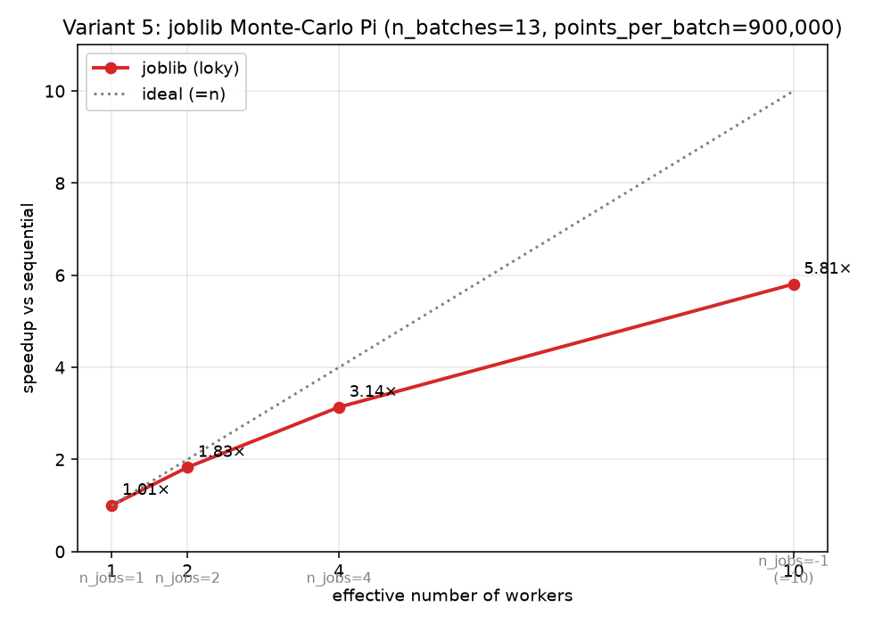

# Отчёт по лабораторной работе № 3
## «Параллелизация с joblib: Монте-Карло оценка числа Pi»

| Параметр           | Значение                                                                     |
| ------------------ | ---------------------------------------------------------------------------- |
| Дисциплина         | Параллельные и распределённые вычисления в научных и прикладных задачах      |
| Магистрант         | Маратов Ерасыл                                                               |
| Группа             | ВТиПО-25                                                                     |
| Номер варианта     | **5**                                                                        |
| Параметры варианта | n_batches = 13, points_per_batch = 900 000, seed = 2065                      |
| Дата выполнения    | 2026-09-23                                                                   |
| Оборудование       | Apple M1 Pro (8 P-ядер + 2 E-ядра, 10 логических), macOS, Python 3.14, joblib 1.6.0 (backend `loky`) |
| Репозиторий        | https://github.com/Yerassyl20036/parallel_computing_fall_2026 (папка `week3/`) |

---

## 1. Цель работы

Освоить `joblib.Parallel`/`delayed` на классическом embarrassingly parallel примере (Монте-Карло оценка числа Pi) и научиться выбирать разумное число воркеров: экспериментально сравнить время при `n_jobs = 1, 2, 4, -1` относительно последовательной реализации и объяснить наблюдаемую субэффективность на большем числе воркеров.

## 2. Описание реализованной параллельной части

Оригинальный `starter.py` не изменялся; реализация вынесена в `solution.py`. Ключевая функция:

```python
from joblib import Parallel, delayed
from starter import estimate_pi_batch

def parallel_estimate_pi(n_batches, points_per_batch, seed, n_jobs):
    inside_per_batch = Parallel(n_jobs=n_jobs)(
        delayed(estimate_pi_batch)(points_per_batch, seed + b)
        for b in range(n_batches)
    )
    total_inside = sum(inside_per_batch)
    total_points = n_batches * points_per_batch
    return 4.0 * total_inside / total_points
```

Комментарии по решению:

- **Гранула = один батч.** Задача уже распилена преподавателем на `n_batches` независимых партий, `delayed(estimate_pi_batch)(...)` создаёт `n_batches` отложенных вызовов; joblib раздаёт их по воркерам.
- **Детерминированный `seed + b`.** Тот же расчёт, что и в `sequential_estimate_pi`, поэтому результат `pi_estimate` бит-в-бит совпадает с последовательной версией на любом `n_jobs` — суммирование целых `inside` ассоциативно, порядок неважен.
- **Backend по умолчанию — `loky`** (processes). Правильный выбор для CPU-bound Python-кода: `estimate_pi_batch` крутит чистый Python-цикл, где GIL никогда не отпускается — threading-backend был бы бесполезен (см. лабораторную № 2).
- **`n_jobs = -1`** — joblib подставляет `os.cpu_count()`; на M1 Pro это **10**.
- **`n_jobs = 1`** — joblib в этом режиме не поднимает пул воркеров, а исполняет вызовы в текущем процессе; поэтому его время должно быть ≈ sequential. Это удобный контроль оверхеда самого joblib.
- **Редукция суммой** — минимальная возможная (`O(n_batches)`), никакой дополнительной синхронизации между воркерами не требуется. Точно тот же паттерн `map + reduce`, что описан в теории embarrassingly parallel.

Замеры проводились скриптом `solution.py --benchmark --repeats 3`, результат сохранён в `results/bench.json`; график speedup построен отдельным `plot_speedup.py` → `results/speedup.png`.

## 3. Результаты

### 3.1. Сводная таблица (минимум из 3 запусков, в секундах)

| Конфигурация     | min, с | median, с |    Pi оценка |
| ---------------- | -----: | --------: | -----------: |
| sequential       |  2,800 |     2,817 |  3,141544957 |
| joblib, n_jobs=1 |  2,784 |     2,787 |  3,141544957 |
| joblib, n_jobs=2 |  1,530 |     1,543 |  3,141544957 |
| joblib, n_jobs=4 |  0,893 |     0,896 |  3,141544957 |
| joblib, n_jobs=-1 (=10) | **0,482** | 0,493 | 3,141544957 |

### 3.2. Speedup относительно sequential (baseline = 1,00×)

| n_jobs        | 1 |     2 |     4 | -1 (=10) |
| ------------- | -----: | ----: | ----: | -------: |
| speedup       | 1,01×  | 1,83× | 3,14× | **5,81×** |
| идеал (=n)    | 1,00×  | 2,00× | 4,00× | 10,00×    |
| эффективность | 101 %  |  92 % |  79 % |  58 %    |

### 3.3. График



Красная линия — измеренный speedup, серая пунктирная — идеальный (`y = n`). На малом числе воркеров реальный speedup идёт близко к идеальному (n=2 — 92 % эффективности), затем всё сильнее отклоняется вниз.

## 4. Интерпретация результатов

Ускорение есть на всех конфигурациях, включая `n_jobs = 1` (за счёт исключительно нулевого оверхеда, а не параллелизма). Дальше — почему эффективность падает по мере роста `n_jobs`:

- **`n_jobs = 1` → 1,01×.** joblib с одним воркером не поднимает `loky`-пул, а исполняет `delayed`-вызовы в текущем процессе, поэтому получаем практически sequential-время (лёгкая случайная разница ±1 %).
- **`n_jobs = 2` → 1,83× (эффективность 92 %).** Небольшой недобор относительно идеальных 2× — это стартовый оверхед `loky` (`spawn` двух процессов + повторный импорт `starter.py`) плюс лёгкий дисбаланс: 13 батчей на 2 воркера = 7 + 6, worker с 7 батчами задерживает join.
- **`n_jobs = 4` → 3,14× (79 %).** Дисбаланс усиливается: 13 / 4 = 4 + 4 + 3 + 2, последний воркер простаивает пока «толстый» доделывает свои 4 батча — теоретический потолок при таком раскладе ≈ 13 / 4 / ceil(13/4) = 3,25×, мы получили 3,14× — уже почти в потолок.
- **`n_jobs = -1 (=10)` → 5,81× (58 %).** Здесь работают три эффекта одновременно:
  1. **Крупная гранула на пределе.** 13 батчей на 10 воркеров — 3 воркера получают по 2 батча, 7 воркеров — по одному; makespan определяется «толстыми» воркерами, теоретический потолок при равном времени батча ≈ 13/2 = 6,5×. Мы получили 5,81× — на 90 % от этого потолка.
  2. **Гетерогенные ядра M1 Pro.** Из 10 логических ядер 8 — P-cores (~3,2 ГГц), 2 — E-cores (~2,0 ГГц); E-ядра примерно в 1,5–2× медленнее на чистом Python. Батчи на E-ядрах становятся «тяжёлыми» — makespan растёт.
  3. **Оверхед `spawn` + IPC.** 10 процессов loky × повторный импорт модуля + сериализация `inside` (маленькая) при join. Это ~50–100 мс — заметно на фоне 0,48 с.

**Практический вывод по «разумному числу воркеров».** Наилучшая абсолютная скорость — у `n_jobs = -1`, но эффективность (speedup / n) уже упала до 58 %. Sweet spot по эффективности здесь — `n_jobs ≈ 4` (79 % и всё ещё в 3,1× быстрее); если задача чисто CPU-bound и нет других потребителей ядер, брать `-1` оправдано ради минимального wall-time. Если несколько таких задач крутятся параллельно на одной машине, разумнее давать каждой `n_jobs = os.cpu_count() // n_parallel_jobs`, оставляя 1 ядро системе.

## 5. Контрольные вопросы

### 1. Что такое embarrassingly parallel задача и почему Монте-Карло Pi — её эталон?

**Embarrassingly parallel** (ещё «pleasingly parallel») — задача, которую можно разбить на подзадачи, между которыми **нет обмена данными**, нет разделяемого состояния и нет зависимостей по порядку выполнения. Единственная точка синхронизации — финальная редукция результатов подзадач в один ответ.

Монте-Карло Pi идеально подходит: каждый батч генерирует свою последовательность точек из своего `Random(seed + b)`, считает своё локальное `inside`, ничего не читает и не пишет за пределами своей области. Финальная редукция — обычная сумма `n_batches` целых чисел. Никаких блокировок, очередей, барьеров — только `map + reduce`. Именно поэтому speedup ограничен снизу практически только стартовым оверхедом раннера (у нас — `loky`) и гранулярностью задач.

### 2. Что делает `joblib.delayed`? Почему нельзя написать `Parallel(...)(estimate_pi_batch(...) for ...)`?

`delayed(fn)` — это фабрика, которая заворачивает функцию и её будущие аргументы в **тройку** `(fn, args, kwargs)` без немедленного вызова. Тогда генератор внутри `Parallel(...)` производит **описания вызовов**, а не результаты. Сам `Parallel` разбирает эти описания, сериализует `(fn, args, kwargs)` через `cloudpickle`, отправляет в воркеры и вызывает `fn(*args, **kwargs)` уже там.

Без `delayed` конструкция `Parallel(...)(estimate_pi_batch(pn, s + b) for b in range(N))` эквивалентна `Parallel(...)([результат1, результат2, ...])`: генератор породит **готовые результаты** ещё до того, как `Parallel` их увидит — вся работа сделана последовательно в главном процессе, а `Parallel` получит только список чисел и вернёт его обратно. Никакой параллелизации не случится. Именно `delayed` откладывает вызов до момента, когда пул воркеров решит, кому его дать.

### 3. Какие backend-ы есть у joblib и как выбрать под задачу?

| Backend       | Что это                                       | Когда брать                                                                                     |
| ------------- | --------------------------------------------- | ----------------------------------------------------------------------------------------------- |
| `loky` (default) | Пул процессов на loky (fork/spawn + pickle)   | CPU-bound Python-код (наш случай). Обходит GIL, платит `spawn` и IPC.                           |
| `multiprocessing` | Голый `multiprocessing.Pool`                  | То же самое, что `loky`, но менее устойчив к падениям воркеров. Осталось для обратной совместимости. |
| `threading`      | Пул потоков (`ThreadPoolExecutor`)             | I/O-bound; или CPU-bound код в C/NumPy/numba, освобождающих GIL. Не годится для чистого Python-CPU. |
| `dask`           | Через `Client(...)` на Dask-кластере           | Распределённое исполнение на нескольких машинах; больше данных, чем в память ноды.               |
| `ray`            | Аналогично, через Ray-cluster                  | Гетерогенные задачи, stateful actors, GPU-workers.                                              |

Правило выбора: сначала оценить, отпускает ли внутренняя работа GIL. Если да (numpy, sleep, IO) — брать `threading` (дешевле). Если нет (чистый Python-цикл, как у нас) — `loky` для процессов. Распределённое исполнение — только если задача не влезает в одну машину.

### 4. Почему `n_jobs = -1` часто оказывается **не** оптимальным выбором?

Три причины, все три видны на нашем графике:

1. **`n_jobs > n_batches / 2` — многие воркеры простаивают.** Если задач меньше, чем воркеров умножить на 2, часть воркеров получит 0–1 задачу и будет ждать; ускорение упирается в makespan «толстых» воркеров. Наш случай: 13 батчей на 10 воркеров — теоретический потолок 6,5×.
2. **Растущий оверхед `spawn` + IPC.** Каждый воркер `loky` — новый процесс с полным импортом модулей. При 10 воркерах это ~100 мс стартового оверхеда, который на короткой задаче (≈ 0,5 с) съедает ~20 % выигрыша.
3. **Гетерогенные/логические ядра.** На M1 Pro 2 из 10 «логических» ядер — E-cores, они в 1,5–2× медленнее; на Intel с Hyper-Threading `cpu_count()` тоже удваивает физические ядра, но два потока на одном ядре конкурируют за исполнительные блоки и дают ×1,2–1,4, а не ×2. Разумнее использовать `os.cpu_count() - 1` или `physical_cores` — заодно оставляет ядро под саму ОС/joblib-контроллер.

Плюс на серверах: `-1` может перехватить все ядра и уронить SLO соседних сервисов. Практика — брать `n_jobs = min(n_batches, physical_cores)` и при необходимости оставлять `os.cpu_count() // 2` для конкурирующих нагрузок.

### 5. Как получить репродуцируемый результат при параллельных Монте-Карло вычислениях?

Три ортогональных приёма, все работают одновременно:

1. **Детерминированное разбиение сидов.** У нас `estimate_pi_batch(points_per_batch, seed + b)` — каждый батч получает свой сид как функцию от глобального `seed` и своего индекса `b`. Порядок исполнения батчей не влияет на итоговое `inside` — сумма ассоциативна на целых. Именно поэтому наш `parallel_estimate_pi` даёт бит-в-бит тот же `Pi ≈ 3,141544957` при любом `n_jobs`.
2. **Ассоциативная редукция или сохранение порядка.** С целочисленным суммированием `sum([...])` порядок не важен. Если бы мы усредняли `float`-ы, порядок бы уже влиял (сложение float неассоциативно). Тогда — либо сортировать частичные результаты перед свёрткой, либо использовать целочисленные накопители (как здесь), либо `math.fsum`.
3. **Отдельный RNG на батч, не общий.** `random.Random(seed)` создаёт **новый экземпляр** с собственным состоянием — в разных процессах эти состояния независимы и предсказуемы. Использовать модульный `random.random()` в параллельных воркерах — путь к катастрофе: у каждого нового процесса `loky` `random` инициализируется своим системным сидом (из PID/времени), результат перестанет воспроизводиться. Для numpy — тот же принцип: `np.random.default_rng(seed + b)`, а не `np.random.rand(...)`.

Дополнительно (не в этом задании, но правильная практика): фиксировать версии `python`, `joblib`, `numpy`; логировать `seed` и `cpu_count`; в отчётах приводить min/median по нескольким запускам, а не одно число.

## 6. Код и артефакты

- `starter.py` — оригинальный стартовый код (не изменялся).
- `solution.py` — реализация `parallel_estimate_pi()` через joblib + benchmark-харнесс.
- `plot_speedup.py` — построение графика по `results/bench.json`.
- `results/bench.json` — сырые замеры (min/median/samples для каждой конфигурации).
- `results/bench_stdout.txt` — консольный вывод замера.
- `results/speedup.png` — график speedup.

Ссылка на репозиторий: https://github.com/Yerassyl20036/parallel_computing_fall_2026
